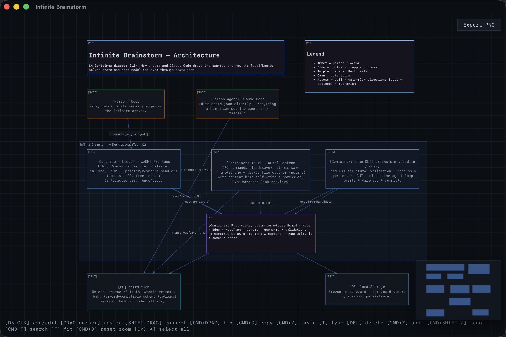
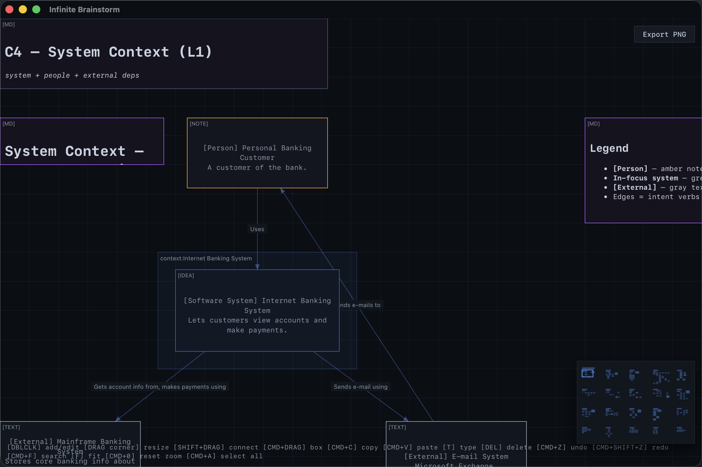

<p align="center">
  <h1 align="center">Infinite Brainstorm</h1>
  <p align="center">
    <strong>An agent-native infinite canvas for human-AI collaboration</strong>
  </p>
  <p align="center">
    <a href="#screenshots">Screenshots</a> •
    <a href="#features">Features</a> •
    <a href="#quick-start">Quick Start</a> •
    <a href="#claude-code-skill">Claude Code Skill</a> •
    <a href="#architecture-diagrams">Diagrams</a> •
    <a href="#usage">Usage</a> •
    <a href="#contributing">Contributing</a>
  </p>
  <p align="center">
    
    
    
    
  </p>
</p>

---

## Why Infinite Brainstorm?

Most productivity tools treat AI as an afterthought. **Infinite Brainstorm is different.**

It's built from the ground up so that anything a human can do on the canvas, an AI assistant can do by editing a JSON file:

```
You: "Create a mind map about machine learning"
Claude Code: *edits board.json*
Canvas: *updates instantly*

You drag nodes around. AI generates content.
You organize visually. AI does bulk operations.
Everything stays in sync. Automatically.
```

**The secret?** A simple JSON file (`board.json`) that both humans and AI can read and write. No APIs. No SDKs. Just a file.

## Screenshots

<p align="center">
  
  <br>
  <em>The app's own architecture, drawn on its own canvas — generated by Claude Code editing <a href="examples/self-architecture/board.json"><code>board.json</code></a>.</em>
</p>

<p align="center">
  
  <br>
  <em>Software-engineering diagrams are first-class: C4 (context/container/component), UML (sequence/class/state/activity), ERD, DFD, microservices maps, event-driven flows, hexagonal, deployment, ADR logs — see <a href="examples/arch-gallery/board.json"><code>examples/arch-gallery</code></a>.</em>
</p>

## Features

- **Infinite Canvas** — Pan and zoom without limits
- **6 Node Types** — Text, ideas, notes, images, markdown, link previews
- **Directed Graph** — Edges render as arrows with arrowheads clipped to node borders
- **Node Metadata** — Color, tags, status, group, and priority fields for categorization
- **Real-Time Sync** — External file changes appear instantly (<100ms)
- **Agent-Native** — AI assistants edit `board.json` directly, with a bundled [Claude Code skill](#claude-code-skill), a [JSON Schema](#claude-code-skill), and headless [`validate`/`query` CLI](#cli-validate--query)
- **Crash-Safe Saves** — Atomic writes (temp + rename, with `.bak`); a parse error preserves your board and shows a banner instead of blanking it
- **Search** — Cmd+F overlay filters by text, tags, or status; Enter recenters the first match
- **Minimap** — Bottom-right overview with click-to-recenter
- **PNG Export** — Save the current viewport as an image
- **Undo/Redo** — History stack (Cmd+Z / Cmd+Shift+Z), captures text edits and selection
- **Image Paste** — Cmd+V pastes clipboard images into `./assets/`
- **Node Resizing** — Drag corner handles (min 50x30); snap-to-grid on drag release
- **Link Previews** — Open Graph metadata fetching for URL nodes (SSRF-hardened)
- **Obsidian Integration** — Link nodes pointing to local `.md` files render as markdown
- **Dual Storage** — Desktop app uses filesystem, browser uses localStorage
- **Directory-Based** — Each project folder gets its own board
- **Board Templates** — 20 ready-to-use layouts: 6 general (mind map, kanban, flowchart, SWOT, pros/cons, timeline) + 14 software-architecture diagrams (C4, UML, ERD, DFD, microservices, event-driven, hexagonal, deployment, ADR)
- **Software-Engineering Diagrams** — A standard visual language for C4, UML, ERD, DFD and more, so Claude Code draws architecture the canonical way ([details](#architecture-diagrams))

## Quick Start

### Run from Source

```bash
# Prerequisites
rustup target add wasm32-unknown-unknown
cargo install trunk tauri-cli

# Clone and run
git clone https://github.com/LucianoLupo/infinite-brainstorm.git
cd infinite-brainstorm
cargo tauri dev
```

### Build and Install

```bash
# Build release binary
cargo tauri build

# Install the CLI launcher
mkdir -p ~/.local/bin
ln -sf "$(pwd)/scripts/brainstorm" ~/.local/bin/brainstorm

# Add to PATH (if not already)
echo 'export PATH="$HOME/.local/bin:$PATH"' >> ~/.zshrc
source ~/.zshrc

# Run from any directory
brainstorm                    # Current directory
brainstorm ~/projects/ideas   # Specific directory
```

<details>
<summary><strong>Troubleshooting: Trunk stuck downloading wasm-bindgen</strong></summary>

Install manually:
```bash
cargo install wasm-bindgen-cli --version 0.2.108
```
</details>

## Claude Code Skill

The repo includes a [Claude Code skill](https://code.claude.com/docs/en/skills) at `.claude/skills/infinite-brainstorm/` with:

- **Full board.json schema** — node types, metadata fields, edge format
- **7 layout algorithms** — grid, tree, radial, kanban, flowchart, timeline, clustering
- **20 board templates** — 6 general + 14 [software-architecture diagrams](#architecture-diagrams)
- **A standard visual language** — a decoder ring (node type + color + text prefix + edge label) so C4/UML/ERD/DFD/etc. read the same way to every engineer
- **Common operations** — step-by-step instructions for reading, creating, reorganizing boards

### Install the skill for global access

The skill auto-loads when you use Claude Code inside this repo. To use it from **any directory**, symlink it:

```bash
ln -sf "$(pwd)/.claude/skills/infinite-brainstorm" ~/.claude/skills/infinite-brainstorm
```

Now Claude Code can brainstorm with you anywhere — just say "create a mind map about X" or "set up a kanban board".

### Templates

| Template | Use Case |
|----------|----------|
| `mind-map.json` | Central topic with radial branches and sub-ideas |
| `kanban.json` | Status columns (To Do, In Progress, Review, Done) |
| `flowchart.json` | Sequential steps with decision branches |
| `swot.json` | Strengths, Weaknesses, Opportunities, Threats |
| `pros-cons.json` | Two-column decision analysis |
| `timeline.json` | Horizontal phases with milestones |

Templates live in `.claude/skills/infinite-brainstorm/templates/`. Claude Code reads them automatically when creating boards.

## Architecture Diagrams

The canvas isn't just for mind maps — it speaks **standard software-engineering notation**. The skill ships a fixed visual language (node type + per-node color + text prefix + edge label) so any reader, human or agent, decodes a diagram the same way: actors are amber, the in-focus system is highlighted, datastores are cyan, infrastructure is violet, every edge carries its protocol/cardinality/direction, and every `group` is a boundary (system, layer, swimlane, trust zone, deployment node).

Ask Claude Code for any of these and it picks the right one by **question + audience + abstraction level**:

| Diagram | Answers the question | Template |
|---------|----------------------|----------|
| **C4 — System Context** (L1) | What is this system, who uses it, what does it depend on? | `c4-context.json` |
| **C4 — Container** (L2) | What apps/datastores exist and how do they talk? | `c4-container.json` |
| **C4 — Component** (L3) | How is one complex container organized inside? | `c4-component.json` |
| **UML Sequence** | In what exact order do the parts collaborate for one scenario? | `uml-sequence.json` |
| **UML Class** | What are the types/fields and how do they relate (is-a / has-a)? | `uml-class.json` |
| **UML State Machine** | What states can this be in, and what events move it? | `uml-state-machine.json` |
| **UML Activity** (swimlanes) | What's the workflow, where does it branch, who owns each step? | `uml-activity.json` |
| **ERD** (crow's foot) | What's the relational schema — tables, keys, cardinality? | `erd-crows-foot.json` |
| **Data Flow Diagram** | Where does data come from, what transforms it, where does it rest? | `dfd-context.json` |
| **Microservices Service Map** | Which services exist, who calls whom, who owns which DB? | `microservices-service-map.json` |
| **Event-Driven Flow** | Who publishes which events and who consumes them? | `event-driven-flow.json` |
| **Hexagonal** (ports & adapters) | What's core domain vs replaceable plumbing? | `hexagonal-ports-adapters.json` |
| **Deployment** | What runs where — instances, infra, networking — per environment? | `deployment.json` |
| **ADR / Decision Log** | Why is the architecture this way, and what was traded away? | `adr-log.json` |

A worked gallery of all of these lives in [`examples/arch-gallery/board.json`](examples/arch-gallery/board.json) (222 nodes across C4/UML/ERD/DFD/microservices and more). The app's own [self-architecture board](examples/self-architecture/board.json) is a C4 container diagram of Infinite Brainstorm itself — open it with `brainstorm examples/self-architecture`.

## Usage

### Controls

| Action | What it does |
|--------|--------------|
| **Double-click** empty space | Create new node |
| **Double-click** node | Edit text (or open modal for image/md/link) |
| **Click** node | Select it |
| **Cmd/Ctrl + click** | Add/remove from selection |
| **Drag** node | Move all selected nodes |
| **Drag** corner handle | Resize node (min 50x30) |
| **Drag** empty space | Pan the canvas |
| **Cmd/Ctrl + drag** | Box select multiple nodes |
| **Shift + drag** from node | Create directed edge to target |
| **Scroll wheel** | Zoom (centered on cursor) |
| **Cmd/Ctrl + V** | Paste clipboard image at cursor |
| **T** | Cycle node type on selected nodes |
| **Cmd/Ctrl + A** | Select all nodes |
| **Cmd/Ctrl + F** | Search (filter by text/tags/status, Enter recenters first match) |
| **F** | Fit all nodes to view |
| **Cmd/Ctrl + 0** | Reset zoom to 1.0 |
| **Delete / Backspace** | Delete selected nodes or edge |
| **Cmd/Ctrl + Z** | Undo |
| **Cmd/Ctrl + Shift + Z** | Redo |
| **Escape** | Clear selection, cancel editing, close active modal |

### Node Types

Under the **Gotham** theme all six types render as near-uniform blue-gray surfaces (the per-type background differs by only a few points per channel) — visual distinction comes from the optional per-node [`color`](#data-format) override, not the type. The type drives *behavior*, not color:

| Type | Behavior | Use Case |
|------|----------|----------|
| `text` | Plain text | Default, simple text |
| `idea` | Plain text | Highlighted concepts |
| `note` | Plain text | Annotations, comments |
| `image` | Thumbnail; double-click opens 90% modal | Embedded images (local path or URL) |
| `md` | Renders markdown; double-click opens editor | Rendered markdown content |
| `link` | OG preview card; click copies, double-click opens | URL preview, or local `.md` path rendered as markdown |

### Data Format

All data lives in `board.json`:

```json
{
  "nodes": [
    {
      "id": "unique-id",
      "x": 0.0,
      "y": 0.0,
      "width": 200.0,
      "height": 100.0,
      "text": "Your content here",
      "node_type": "idea",
      "color": "#ff6600",
      "tags": ["urgent", "pricing"],
      "status": "in-progress",
      "group": "cluster-a",
      "priority": 2
    }
  ],
  "edges": [
    {
      "id": "edge-id",
      "from_node": "source-node-id",
      "to_node": "target-node-id"
    }
  ]
}
```

**Edges are directed** — rendered as arrows from `from_node` to `to_node` with arrowheads at the target. An optional `label` field is drawn at the edge midpoint.

The board may carry an optional top-level `version` (defaults to `1`); files without it load unchanged. `node_type` is forward-compatible — an unrecognized value renders with neutral fallback styling rather than failing to load.

**Node metadata** (all optional):

| Field | Type | Description |
|-------|------|-------------|
| `color` | `string` | Custom border color (hex, e.g. `"#ff6600"`) |
| `tags` | `string[]` | Freeform tags for categorization |
| `status` | `string` | Workflow status (e.g. `"todo"`, `"in-progress"`, `"done"`) |
| `group` | `string` | Group ID for clustering related nodes |
| `priority` | `number` | Priority level 1-5 (renders as P1-P5) |

### Working with AI Assistants

The app watches `board.json` for external changes. Any AI assistant can:

1. **Read** the board: `cat board.json`
2. **Add nodes** with calculated positions
3. **Create directed edges** between related ideas
4. **Categorize** with metadata (tags, status, priority, color)
5. **Reorganize layouts** programmatically
6. **Apply templates** for common board structures

Changes sync to the canvas in under 100ms.

See [`CLAUDE.md`](./CLAUDE.md) for detailed AI integration docs, or install the [Claude Code skill](#claude-code-skill) for the best experience.

### CLI: validate & query

Two headless subcommands let agents inspect a board without opening the UI — making the loop **write → validate → commit**. With no subcommand, `brainstorm` launches the desktop app.

```bash
# Validate structure: duplicate/dangling ids, non-finite coords, bad priority.
# Exits non-zero on any structural error; unknown keys / future versions warn only.
brainstorm validate              # validates ./board.json
brainstorm validate other.json

# Read-only queries, printed to stdout.
brainstorm query count           # node + edge counts
brainstorm query nodes
brainstorm query edges
brainstorm query node:<id>       # one node by id
brainstorm query type:idea       # nodes of a node_type
brainstorm query tag:urgent      # nodes carrying a tag
```

The board format is defined by a JSON Schema at `.claude/skills/infinite-brainstorm/board.schema.json`.

## Architecture

```
infinite-brainstorm/              # Cargo workspace
├── crates/
│   └── brainstorm-types/        # Shared data model + geometry, used by both crates
│       └── src/lib.rs           # Board, Node, Edge, NodeType, Camera, validation
│
├── src/                          # Frontend (Leptos WASM)
│   ├── main.rs                  # Entry point
│   ├── app.rs                   # Main component, event handlers, state
│   ├── interaction.rs           # DOM-free reducer (BoardAction + reduce)
│   ├── canvas.rs                # Canvas rendering (rAF coalescer, culling, HiDPI)
│   ├── state.rs                 # Re-exports brainstorm-types + camera persistence
│   ├── history.rs               # Undo/redo history (bounded)
│   └── components/              # Extracted UI components
│       ├── error_banner.rs      # Non-blocking parse-error banner
│       ├── minimap.rs           # Bottom-right overview, click-to-recenter
│       ├── search_overlay.rs    # Cmd+F search
│       ├── image_modal.rs       # Full-screen image preview
│       ├── markdown_modal.rs    # Markdown editor modal
│       ├── markdown_overlays.rs # Markdown rendering in nodes
│       └── node_editor.rs       # Inline text editor
│
├── src-tauri/                   # Backend (Tauri v2)
│   ├── src/main.rs              # clap CLI (validate/query/GUI)
│   ├── src/lib.rs               # IPC commands, atomic save, file watcher
│   └── tests/                   # Integration tests (atomic_save, board_roundtrip, watcher)
│
├── .github/workflows/ci.yml     # fmt + clippy + tests + wasm32 build
│
├── .claude/skills/              # Claude Code skill
│   └── infinite-brainstorm/
│       ├── SKILL.md             # Schema, layouts, operations
│       ├── board.schema.json    # JSON Schema (source of truth for board.json)
│       └── templates/           # 20 board templates (6 general + 14 architecture)
│
├── scripts/brainstorm           # CLI launcher
├── board.json                   # Your data (gitignored)
├── CLAUDE.md                    # AI assistant reference
└── README.md
```

### Key Design Decisions

| Decision | Why |
|----------|-----|
| **JSON file as API** | AI assistants edit it directly. No complex integrations needed. |
| **Shared types crate** | `crates/brainstorm-types` is the one data model both frontend and backend re-export — type drift is a compile error, not a silent bug. |
| **Reducer layer** | All mutations flow through a pure `reduce(board, action)` in `interaction.rs`, so logic is DOM-free, unit-tested, and undo is snapshotted in one place. |
| **Atomic saves** | Write to `.tmp`, fsync, rename over `board.json` (with a `.bak` copy) — never a partial write. A parse error preserves the board and shows a banner. |
| **File watching** | External changes sync instantly. Self-writes are suppressed by content-hash; reloads defer while you're mid-interaction. Enables real-time AI collaboration. |
| **Directed edges** | Arrows with arrowheads represent flows, dependencies, hierarchies. |
| **Node metadata** | Optional fields (color, tags, status, group, priority) enable agent-driven categorization without schema changes. |
| **Current directory** | Each project folder gets its own board, like git repos. |
| **Dual storage** | Tauri uses filesystem, browser uses localStorage. Same code path. |
| **Skill + schema + templates** | The Claude Code skill bundles a JSON Schema, layout docs, and templates; the `validate`/`query` CLI closes the agent loop. |

### Security

- **Restrictive CSP** — `tauri.conf.json` locks down sources (`default-src 'self'`, `script-src 'self'`, `object-src 'none'`, `frame-src 'none'`).
- **Sanitized markdown** — Raw HTML in markdown nodes is escaped, so a `board.json` md node can't inject stored XSS.
- **Scoped file reads** — Image/markdown reads are restricted to the board directory (plus `$HOME` for the Obsidian-vault feature), with a 25MB cap and magic-byte MIME sniffing (the file extension is not trusted).
- **SSRF-hardened link previews** — Link fetches reject loopback / link-local / private / CGNAT / ULA addresses at the resolved-IP level on every redirect hop (DNS-rebinding safe), and cap redirects and response size.

## Contributing

Contributions are welcome!

### Development Setup

1. **Fork and clone** the repository
2. **Install prerequisites**: Rust, WASM target, Trunk, Tauri CLI
3. **Run in dev mode**: `cargo tauri dev`
4. **Check both crates**: `cargo check` (frontend, host) and `cargo check --manifest-path src-tauri/Cargo.toml` (backend)
5. **Run the tests**: `cargo test` (workspace host tests) and `cargo test --manifest-path src-tauri/Cargo.toml -- --test-threads=1` (backend)

### Code Structure

| File | What to modify |
|------|----------------|
| `crates/brainstorm-types/src/lib.rs` | Data types (Board, Node, Edge, NodeType), geometry, validation |
| `src/app.rs` | Event handlers, interactions, UI logic |
| `src/interaction.rs` | Pure board mutations (`BoardAction` + `reduce`) |
| `src/canvas.rs` | Canvas rendering, visual appearance |
| `src/state.rs` | Frontend re-export of shared types + camera persistence |
| `src/history.rs` | Undo/redo behavior |
| `src/components/` | Modals, error banner, minimap, search overlay |
| `src-tauri/src/lib.rs` | Backend commands, atomic save, file watcher |
| `src-tauri/src/main.rs` | `validate`/`query` CLI subcommands |

**Note:** The data model lives in the shared `crates/brainstorm-types` crate, which both the frontend and backend re-export — so there's nothing to keep in sync by hand, and a mismatch is a compile error.

### Guidelines

- **Keep it simple** — The codebase is intentionally minimal (~10,000 LOC across the workspace)
- **Test with AI** — Make sure Claude Code can still edit `board.json` after your changes; run `brainstorm validate` on the result
- **Update docs** — If you add features, update `CLAUDE.md`, the skill, `board.schema.json`, and this README
- **Both crates must compile and pass tests** — `cargo test` (host) and `cargo test --manifest-path src-tauri/Cargo.toml` (backend); CI enforces this plus a wasm32 build

Already shipped: PNG export, Cmd+F search/filter, minimap, edge labels, and group backgrounds. Still open:

- [ ] **SVG/PDF export** — Vector export of the canvas (PNG export already exists)
- [ ] **Keyboard navigation** — Arrow keys to traverse connected nodes
- [ ] **Semantic zoom** — Node summaries when zoomed out
- [ ] **Themes** — Light mode, custom color schemes
- [ ] **Touch support** — Mobile/tablet gestures
- [ ] **Multi-board** — Multiple board files per directory, board switcher
- [ ] **Real-time collaboration** — CRDT-based multi-user editing

## Tech Stack

| Component | Technology |
|-----------|------------|
| Desktop framework | [Tauri v2](https://tauri.app) |
| Frontend framework | [Leptos 0.8](https://leptos.dev) |
| Rendering | HTML5 Canvas (HiDPI, requestAnimationFrame coalescing) |
| Language | Rust (Cargo workspace; frontend compiled to WASM) |
| Shared types | `crates/brainstorm-types` (one data model for both crates) |
| CLI | [clap](https://docs.rs/clap) (`validate` / `query` subcommands) |
| File watching | [notify](https://docs.rs/notify) |
| Link previews | [scraper](https://docs.rs/scraper) + [reqwest](https://docs.rs/reqwest) |

## License

MIT License — see [LICENSE](./LICENSE) for details.

---

<p align="center">
  <strong>Built for humans and AI, working together.</strong>
</p>

<p align="center">
  <a href="https://github.com/LucianoLupo/infinite-brainstorm/issues">Report Bug</a> •
  <a href="https://github.com/LucianoLupo/infinite-brainstorm/issues">Request Feature</a>
</p>
